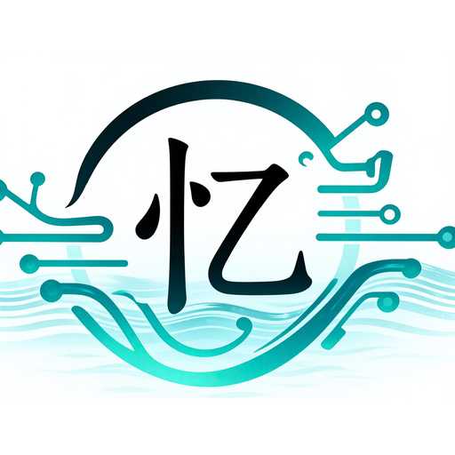
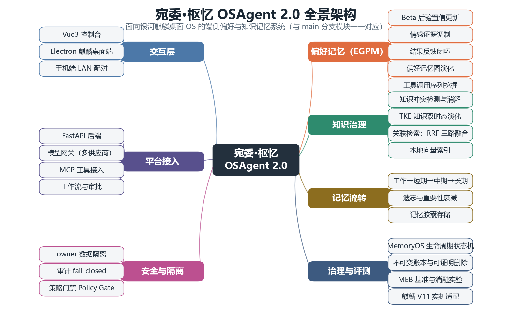

<!-- 宛委·枢忆 README 终稿 v6 | 装配：苏菲 | 骨架：莫妮卡 v1.1 | 三路审校通过（理念·文森特 / 结构·莫妮卡 / 技术事实·艾瑞克） | 红线：阿光红线卡 + 艾瑞克技术校准 | 全链接经仓库文件树核验 | 2026-09-05 -->

<p align="center">
  
</p>

<h1 align="center">宛委·枢忆 WanWei-ShuYi OSAgent</h1>

<p align="center">
  <a href="https://github.com/QianChang-official/wan-wei--shuyi-osagent/actions/workflows/security.yml"></a>
  
  
  
  
</p>

<p align="center"><b>面向信创环境的可审计 Agent 记忆治理平台</b></p>

> *AI 会记住你。但更重要的是——它能证明自己已经忘记。*

<p align="center">
  
</p>

---

## 为什么存在

AI 行业正在打一场记忆军备竞赛：更长上下文、更大记忆库、更强召回。但几乎没有人回答另一个问题——

**怎么证明，它删干净了？**

今天的 AI 会记住很多东西，但没人知道：

- 它到底记住了什么
- 为什么记住
- 什么时候形成
- 是否删除成功
- 会不会重新出现

对个人用户，这是烦恼。对政企单位，这是合规风险，是审计缺口。

当领导问：**"三个月前录入系统的敏感信息，真的删除了吗？"**

大多数平台给不出答案。因为在那里，删除只是一行操作，不是一份证据。

这不是单点的差距，而是阶段的差距。记忆系统的演进分四级：**记住** → **记得更多** → **管理记忆** → **管理记忆产生的责任**。行业的军备竞赛集中在头两级，本仓库从后两级起步——账本、生命周期状态机、五处删除取证与 MHG 事故分级均已交付。

**宛委·枢忆的回答：把删除从"一次操作"，升格为"一份证据"。**

每条记忆的写入、更新、召回、删除，都记入不可变账本；删除须经主表、全文索引、图边、向量、遗留表五处逐项取证，零残留才算完成；已遗忘的记忆由生命周期状态机封死回路，不会复活。

**记忆是资产，就该有账本；遗忘是权利，就该有证明。**

> 我们在做的，是 AI 记忆的信任基础设施：让"被遗忘权"（呼应 PIPL 第 47 条删除权 / GDPR 第 17 条）从纸面承诺，变成可验证的工程事实。

---

## 核心能力

| 能力 | 做什么 | 为什么重要 |
|---|---|---|
| **删除证明** | 对一条已删除记忆，在主表、全文索引、知识图谱边、向量引用、遗留表**五处逐项取证**，全部归零后导出含审计编号的 PDF 证书 | 别的系统告诉你"已删除"，这里交付的是能过审计的证据。删除可验证，正是数据安全合规与等级保护场景的采购语言 |
| **生命周期状态机** | 记忆从 candidate 到 deleted 的每次状态变更都经**10 态转移表**裁决，非法转移直接返回 422；`forgotten` / `deleted` 是不可逆终态 | 多数系统的记忆状态是个自由字符串，"已删除 → 复活"的写入无人拦截。状态机让"遗忘"成为不可逆的事实，而不是一个可被覆盖的标记 |
| **不可变账本** | 每次写入、更新、召回、删除都追加一条账目——操作者、前后内容 SHA-256、风险分级，append-only 由 **SQLite 触发器**强制执行 | 可被 UPDATE/DELETE 的"审计日志"是伪审计。这里篡改账本必须先改 schema，而 schema 改动会留在版本历史里——**篡改行为本身留痕** |
| **来源卡片（Provenance Card）** | 每条记忆携带来源、置信度、有效期与版本链 | AI 引用信息时能出示"出生证明"：从哪来、多可信、是否过期、被谁推翻过。召回结果不再是无法追责的黑箱 |

四项能力，回答同一组问题：**发生了什么**（账本）、**为什么发生**（来源与版本链）、**如何验证**（五处取证与删除证书）、**如何承担责任**（MHG 事故分级与发布冻结，见[技术深水区](#技术深水区)）。

**让记忆的每一次来去，都有据可查。**

> 以上不是文档承诺：治理层完整落在 `backend/app/memoryos/`（约 3.6k 行代码、223 个测试函数），每项能力的代码位置与证据索引见 [docs/INNOVATIONS.md](docs/INNOVATIONS.md)。

---

## 三分钟证据链

> 让每一次遗忘，都经得起审计。

一条命令，完整走一遍敏感记忆从写入到「可证明删除」的全链路：

```bash
python scripts/demo_governance.py --api-key <key>
```

| 步骤 | 动作 | 你会看到什么 |
|---|---|---|
| 1 | 写入一条敏感记忆 | 记忆胶囊创建成功，携带 Policy Gate 审计标记 |
| 2 | 跨会话检索召回 | 无需重复交代背景，直接命中 |
| 3 | 指定删除该记忆 | 硬删除执行完成 |
| 4 | 验证删除完整性 | 主表、全文索引、图边、向量引用、遗留表五处逐项取证，**全部为零** |
| 5 | 导出删除证明 | 生成 PDF 证书，含审计编号与证据链说明 |

**第 4 步是全场唯一没人能现场复刻的演示。**

"删除"在多数系统里是一个布尔标记；在这里，它是一个五点取证的验证过程——存储、索引、关系、向量、遗留表，任何一处残留，都过不了第 4 步。

---

## 快速开始

先选入口，再看细节：

| 入口 | 适合谁 | 形态 |
|------|--------|------|
| **A · 一键证据演示** | 评审 / 围观者 | `scripts/demo_governance.py`，五步证据链现场复刻 |
| **B · 源码自起** | 开发者 | setup → run_dev → 控制台 |
| **C · 麒麟 deb 安装** | 政企 / 信创环境 | Electron deb/rpm + 可选 systemd 用户服务 |
| **D · 嵌入式 API** | 集成方 | REST 治理端点（见[技术深水区](#技术深水区)端点表） |

### 路径 A：三分钟看证据（无需完整部署）

```bash
# 前置：Python 3.10+，任意一家供应商的 API key
python scripts/demo_governance.py --api-key <key>
```

跑完即得上节的五步证据链与 PDF 删除证书。

### 路径 B：本地跑起来

前置条件：Python 3.10+；Node.js 22.12+（仅 Electron 源码构建需要，终端用户安装 deb/rpm 包不需要）。

```bash
# Windows
powershell -ExecutionPolicy Bypass -File .\scripts\setup.ps1
powershell -ExecutionPolicy Bypass -File .\scripts\run_dev.ps1

# Linux / 麒麟 OS
bash scripts/setup.sh
bash scripts/run_dev.sh
```

控制台入口：**http://127.0.0.1:8010/console/**

启动后三步走：

1. **发第一段对话**：进入「万枢工作台」直接提问。未配置模型时走 `local_mock` 通路——零配置也能跑通全流程。
2. **接入模型**：进入「模型接入」视图，从 31 家供应商目录中任选一家，填入 API key。OpenAI 兼容云端供应商（含 DeepSeek）与 AWS Bedrock 已接通真实调用；其余在 alpha 阶段标注为 stub。
3. **说「记住」**：记忆指令写入前经 Policy Gate 校验敏感内容（拦截密码 / 密钥 / 投毒），写入后可在「记忆中枢」查看与编辑。

<!-- TODO: 控制台截图（补图后置于 assets/console.png 并取消注释）
<p align="center"></p>
-->

**路径 C / D**：麒麟桌面构建与安装见 [desktop/README.md](desktop/README.md)（`deb`/`rpm` 双包，`sudo dpkg -i release/wanwei-shuyi-desktop_1.0.0_amd64.deb` 即装）；嵌入式集成直接走治理端点，鉴权与档位规则见下方深水区。

---

## 真实场景

**政务办公**——你说"帮我继续上周的项目汇报"，系统自动召回历史文档与工作记录，无需重复交代背景；而这些召回全部留痕、可审计。

**知识治理**——你说"删除所有关于项目 A 的内容"，系统不只执行删除，还清理关联索引、验证五处残留、输出可归档的证明。

**长期协作**——AI 逐步了解你的工作习惯、项目背景与组织流程，成为专属数字助手；而这一切有账本、有生命周期、有边界。

> 三个场景，同一件事：让"记住"可信，让"忘记"可证。

---

## 实证与对标

**先看一个数字：同一 60 用例集，治理层在场，通过率 58–60/60；拿掉治理层（`no_governance`），46/60——退步 23%。** 14 个失败用例中 12 个来自冲突更新场景：被推翻的旧版本记忆重新出现在召回结果里，冲突正确率直接归零。治理层不是性能开销，是正确性的一部分。（口径：本仓自建 MEB full 用例集，非官方赛题成绩；原始数据见 [`reports/baseline_compare.json`](reports/baseline_compare.json)）

### 性能实测

| 实测项 | 结果 | 测试条件 |
|---|---|---|
| 本机 SQLite FTS5 检索 | **p95 = 0.8072 ms** | 100 次检索、50 个种子记忆胶囊、单机单进程 |
| 银河麒麟 V11 原生 SDK 检索（常驻 bridge） | **HTTP 全链路 p50 = 29 ms / p95 = 83 ms**；SDK 单次 15 ms；1k 条 hot p95 27.9 ms、10k 条 97.4 ms | 麒麟 V11 桌面版实机（6.6 内核 + KSAF），原生向量引擎 + 常驻 bridge（模型只加载一次），[`reports/kylin-native-sdk-evidence/`](reports/kylin-native-sdk-evidence/) |
| MemoryArena-Lite 生产记忆评测 | **5 cases / 16 assertions 全部通过** | `unsafe_autonomy_rate = 0.0`，报告见 [`reports/production_memory_eval_metrics.json`](reports/production_memory_eval_metrics.json) |

治理层（账本、状态机、删除验证）全部是本地 SQLite 操作——性能瓶颈在模型推理，不在治理开销。

### 横向对比

| 维度 | 宛委·枢忆 | Mem0 | MemOS | Graphiti |
|------|----------|------|-------|----------|
| **可证明删除** | ✅ 五处取证 + PDF 证书 | — | — | —（自述 "invalidated — not deleted"） |
| **不可变审计账本** | ✅ append-only，触发器强制 | — | — | — |
| **生命周期治理** | ✅ 10 态 + 422 裁决 | 新算法 ADD-only（自述 no UPDATE/DELETE） | 编辑 / 删除 API，无状态机裁决 | 双时序事实失效 |
| **信创 / 麒麟适配** | ✅ V11 验收 + deb/rpm | — | — | — |
| **交付形态** | 单节点全本地，无云端形态 | Library / 自托管 / 云平台 | 云 API / 云插件 / 自托管 / 本地插件 | OSS 自托管（商业版 Zep 为托管云） |

> 竞品信息取自各家 README（2026-09 快照）；"—"表示其 README 未宣称该能力，不代表产品绝对缺失，选型前请以各家官方文档为准。各家在自身主线（分数 / 调度 / 时序图谱）上都很强，只是「删除可证明」这条线，目前没有人在做。完整评测口径见 [docs/BENCHMARK.md](docs/BENCHMARK.md)。

---

## 诚实边界

- 系统当前为单节点 alpha 版（v0.11.0），功能矩阵以 [docs/INNOVATIONS.md](docs/INNOVATIONS.md) 实现清单为准。
- MEB 成绩为本仓自建用例集成绩，非公开赛题成绩。
- 成本金额为估算值（token 数按字符数 × 0.3 粗估），账目自带估算说明。

**让 AI 可审计之前，先让自己可审计。**

---

## 技术深水区

<details>
<summary><b>治理层全景与完整端点表</b></summary>

**平台架构**：FastAPI 后端 + Vue3 控制台 + Electron 麒麟桌面端（银河麒麟 V11 x86_64，deb 安装包交付）。

**记忆治理层（MemoryOS）**：实现在 `backend/app/memoryos/`（约 3.6k 行、223 个测试函数，参数化展开 277 项），与记忆底座（`memory_runtime`）构成「写入闸门 → 生命周期 → 检索 → 治理验证 → 账本审计」闭环。

| 治理能力 | 说明 |
|---|---|
| MHG 事故分级 | 1–5 级；未解决的 MHG≥3 自动触发发布冻结。刻意不并入 `/health/ready`——治理冻结与存活探针分离，冻结不等于宕机 |
| 经济账本 | 逐条记忆的成本 / 收益 / ROI 记账。收益口径 useful=1.0 / neutral=0.1 / **harmful=-2.0**：误导性记忆的损害按两倍计——让一条坏记忆的 ROI 明确转负，而不是被几次中性召回稀释 |
| 健康度 MHS | 过期率、冲突率、噪声率、删除残留等聚合成 0–100 分（≥80 healthy / ≥60 warning / 其余 critical）；趋势曲线只来自显式采样，没有采样就返回空序列，不用即时值伪造历史 |
| MEB 评测 | 5 类用例（偏好提取 / 知识召回 / 冲突更新 / 遗忘 / 投毒）；mini 套件挂在 PR 门禁上，分数进 CI 才许合并 |
| MQ 能力画像 | 记忆五子能力分项评分；`iq` 恒为 `null`——本系统测记忆治理（MQ），不测推理（IQ），不编造分数 |

**安全边界**：

- 回环免密默认**只读**（GET/HEAD 放行），写操作必须带 key。
- Origin / Host 校验阻断 CSRF 与 DNS-rebinding。
- SSRF 防护与代理共存，pinned-IP 白名单控制出向连接。
- 自动化工作流按执行档位分级：human_review（默认）/ sandbox / device。

**治理层端点一览**（跨属主请求按「不存在」处理返回 404，不泄漏记忆存在性）：

| 域 | 方法与路径 | 说明 |
|---|---|---|
| 生命周期 | `POST /memory/lifecycle/transition` | 受裁决的转移，非法转移 422 |
| | `POST /memory/lifecycle/confirm` | 确认 candidate / 放行 quarantined |
| | `POST /memory/lifecycle/resolve-conflict` | 裁决冲突，维护 supersedes 版本链 |
| | `POST /memory/lifecycle/scan-stale` | 扫描降权候选 |
| | `GET /memory/lifecycle/{capsule_id}` | 单条状态查询 |
| 账本与治理 | `GET /memory/ledger/{capsule_id}` | 不可变账目 |
| | `GET /memory/governance/release-gate` | 发布闸门状态 |
| | `GET/POST /memory/governance/incidents` | MHG 事故查询 / 登记 |
| | `GET /memory/governance/provenance/{capsule_id}` | 来源卡片 |
| | `GET /memory/governance/verify-deletion/{capsule_id}` | 五处删除完整性取证 |
| | `GET /memory/governance/verify-deletion/{capsule_id}/certificate` | PDF 删除证书导出 |
| 经济账本 | `GET /memory/accounting/summary` | 经济汇总（带估算免责说明） |
| | `GET /memory/accounting/{capsule_id}` | 单条记忆账户 |
| 健康度 | `GET /memory/health` | MHS + 子指标 + 问题清单 + 未测量项 |
| | `GET /memory/health/decay` | Decay Panel 三分类 |
| | `GET /memory/health/self-knowledge` | Self-Knowledge Panel |
| | `POST /memory/health/snapshot` | 采样健康度快照 |
| | `GET /memory/health/trend` | MHS 趋势曲线 |
| 评测 | `GET /memoryos/bench/report` | 上次 MEB 实跑报告（未跑过返回 404，不返回样例数据） |
| | `GET /memoryos/mq` | MQ 能力画像 |

</details>

**深入阅读**：

- 七项创新的技术细节、代码位置与证据：[docs/INNOVATIONS.md](docs/INNOVATIONS.md)
- 治理层设计全文（含每处规范偏差及理由）：[docs/MemoryOS-记忆治理层.md](docs/MemoryOS-记忆治理层.md)
- 平台架构与 M1–M3 路线：[docs/万枢平台-架构设计.md](docs/万枢平台-架构设计.md)
- 评测口径与成绩：[docs/BENCHMARK.md](docs/BENCHMARK.md)
- 竞赛交付材料：[competition/](competition/)
- 变更历史与评审记录：[CHANGELOG.md](CHANGELOG.md) · [REVIEW.md](REVIEW.md)
- 安装与排障手册：[使用说明书](使用说明书.md)

---

## 竞赛与研究资源

**竞赛交付**（挑战杯揭榜挂帅 · 银河麒麟赛题）：[赛题总览](competition/README.md) · [问题定义](competition/01-problem.md) · [记忆架构](competition/03-memory-architecture.md) · [基准评测](competition/04-benchmark.md) · [麒麟验收](competition/05-kylin-validation.md) · [答辩材料](competition/挑战杯答辩材料.md)

**文档中心**：[七项创新与证据](docs/INNOVATIONS.md) · [MemoryOS 记忆治理层](docs/MemoryOS-记忆治理层.md) · [万枢平台架构设计](docs/万枢平台-架构设计.md) · [安全编码规范](docs/代码审查规范与安全编码标准.md)；另有 49 份设计与归档文档见 [文档中心合集](文档中心_DOCUMENTATION_HUB.md)。

**研究复现库** [`backend/app/reproduction/`](backend/app/reproduction/)：9 个前沿记忆系统的轻量对照复现层——HippoRAG 图召回、MemoryBank 遗忘曲线、Reflexion 反思评估、MemoryArena 工作台、Agent 记忆工具 API 共 5 个已可运行（复现层共 14 个 REST 端点，黄金测试锁定行为），MemOS MemCube / MemGPT / LoCoMo / 生成式智能体为规划模板。已可运行的 5 个均跑在本项目真实记忆胶囊上（经安全脱敏），每个响应自带 `*_partial` 边界声明：**研究对照用，非官方完整复现**。

---

## 许可证

本项目基于 [木兰宽松许可证 第2版（Mulan PSL v2）](LICENSE) 开源。

---

<p align="center">
  
</p>

<sub>宛委主藏书，故记忆郑重；枢机主开合，故遗忘有门。</sub>

<p align="center"><i>如果记忆定义了一个智能体是谁，那么信任将决定人类是否愿意与它同行。</i></p>
