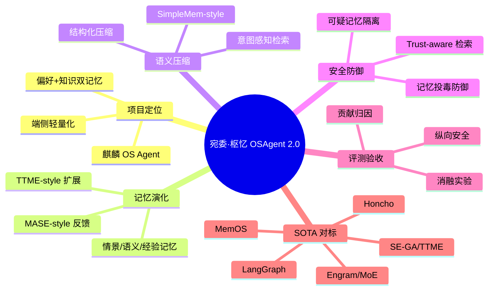

# 宛委·枢忆 OSAgent 2.0 思维导图

```mermaid
mindmap
  root((宛委·枢忆 OSAgent 2.0))
    项目定位
      麒麟 OS Agent
      偏好+知识双记忆
      端侧轻量化
    记忆演化
      TTME-style 扩展
      情景/语义/经验记忆
      MASE-style 反馈
    语义压缩
      SimpleMem-style
      结构化压缩
      意图感知检索
    安全防御
      记忆投毒防御
      Trust-aware 检索
      可疑记忆隔离
    评测验收
      贡献归因
      纵向安全
      消融实验
    SOTA 对标
      MemOS
      LangGraph
      Honcho
      SE-GA/TTME
      Engram/MoE

```
