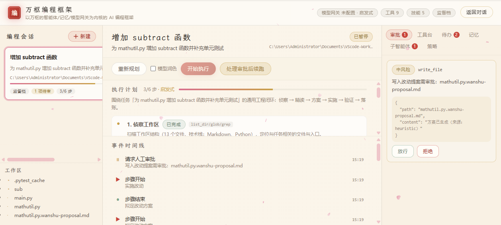
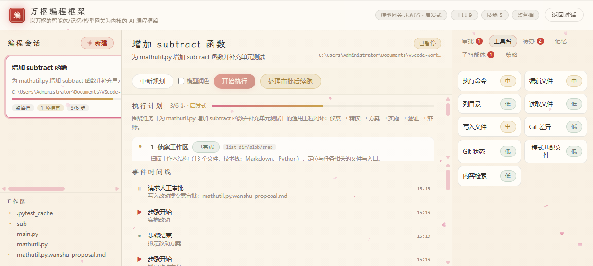
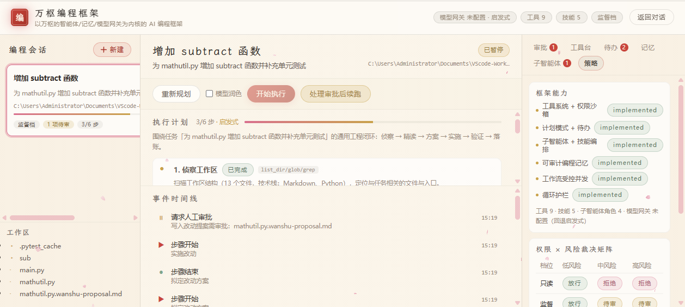

# 万枢编程框架 —— 架构与使用

> 状态：M1 交付版 ｜ 读者：平台建设者、评审、后续维护者
> 代码位置：后端 `backend/app/coding/`，前端 `frontend/console-vue/src/views/coding/`，测试 `backend/app/tests/test_coding_framework.py`

---

## 1. 定位

**万枢编程框架**是一个"大于万枢平台"的 AI 编程框架：万枢既有的**智能体编排、模型网关、可审计记忆治理**是它的**内核**，框架向外长出面向软件工程的能力面——工具沙箱、计划待办、子智能体与技能编排、受控并发工作流、可审计编程记忆。

一句话：**把万枢的"记忆与治理"内核，装进一个能真正动手改代码的编程框架里。**

### 1.1 设计参照（只借鉴思路，不复用代码）

| 参照 | 借鉴的点 | 在本框架的落点 |
|---|---|---|
| **deepseek-harness** | 插件化"一切皆能力"、工具/会话/子智能体/技能/计划/守卫/沙箱的分层 | `tools`（能力注册表）、`subagent`、`skills`、`plan`、`guard`、`sandbox` |
| **wenflow** | 顶层编排与技能执行分离、**File-as-Truth** 的 Prompt 工程、**路径须经用户显式确认** | `orchestrator`（编排）与 `skills`（File-as-Truth）分离；计划的"确认门" |
| **ZCode**（仅思路） | 多形态交付、Provider 抽象、**工作流并发可调 + 实时状态** | `llm`（复用万枢 Provider 解析）、`workflow`（DAG + 并发上限） |

### 1.2 差异化：可审计编程记忆

普通 coding agent 只能"记住"，不能"证明忘记"。本框架把编码过程中的**决策 / 踩坑 / 约定**写入宛委·枢忆的记忆治理层，于是这些记忆天然获得：

- **不可变账本**：每次写入/删除追加账目，append-only 由 SQLite 触发器强制；
- **生命周期状态机**：记忆状态变更经受控转移表裁决；
- **可证明删除**：删除须经主表 / 全文索引 / 图边 / 向量 / 遗留表**五处取证**，全零才算删净。

---

## 2. 架构分层

```
backend/app/coding/
├── constants.py       受控枚举与裁决矩阵（权限模式 × 风险等级、会话/步骤/待办状态机、预算）
├── sandbox.py         工作区边界 + 命令策略        ← 安全地基
├── tools.py           工具注册表 + 内置工具 + 统一裁决
├── plan.py            计划模式与待办（确认门 + 状态机 + 启发式规划器）
├── skills.py          技能系统（File-as-Truth：<workspace>/.wanshu/skills/*/SKILL.md）
├── subagent.py        子智能体委派（最小权限 + 深度上限）
├── guard.py           循环护栏（轮次/工具/重复/超时四道闸）
├── memory_bridge.py   可审计编程记忆（复用 memoryos）
├── workflow.py        工作流受控并发（DAG + 拓扑调度）
├── llm.py             模型适配层（复用万枢模型网关，离线优先）
├── store.py           会话与事件持久化（复用 platform_api.store.JsonStore）
├── orchestrator.py    编码智能体主循环
├── schemas.py         API 请求/响应模型
└── api.py             HTTP 路由（挂载于 /platform/coding）
```

### 2.1 挂载方式

`coding` 包依赖 `platform_api.store` / `platform_api.guards`。若走 `platform_api` 的自动发现会形成环（`coding → platform_api.__init__ → platform_api.coding → coding.api`）。因此在 `app_runtime.py` 中于 `platform_api` **完全初始化之后显式挂载**：

```python
from .coding.api import router as coding_router
app.include_router(coding_router, prefix='/platform')
```

实际路径形如 `/platform/coding/sessions`，与其余平台舱位同前缀、同鉴权、同 owner 隔离。

---

## 3. 四大能力

### 3.1 工具系统 + 权限沙箱

**三条不可动摇的安全口径**：

1. **工作区是硬边界**——路径 `realpath` 规范化后用 `commonpath` 判定，`..` 逃逸、绝对路径越界、符号链接外指一律拒绝；
2. **系统敏感目录永不触碰**（`/etc`、`C:\Windows`……），凭据类文件（`.env`、`id_rsa`、`*.pem`）拒绝写入；
3. **命令不做 shell 解释**——`shlex` 切分后 `subprocess(shell=False)` 执行，shell 元字符无注入面；叠加"安全白名单 + 危险黑名单 + 危险参数模式"三层裁决。

**权限 × 风险裁决矩阵**：

| 档位 | 低风险 | 中风险 | 高风险 |
|---|---|---|---|
| 只读 `readonly` | 放行 | 拒绝 | 拒绝 |
| 监督 `supervised` | 放行 | **待审** | **待审** |
| 信任 `trusted` | 放行 | 放行 | **待审** |

内置工具：`read_file` / `write_file` / `edit_file` / `list_dir` / `glob` / `grep` / `run_shell` / `git_status` / `git_diff`。新增工具只需实现 handler 并 `register()`，无需改动编排器。

### 3.2 计划模式 + 待办

- 计划生成后进入 `awaiting`，**未经确认不允许执行**（编排器强制，对齐 wenflow 的确认门）；
- 步骤状态机 `pending → in_progress → done/failed/skipped`，非法转移抛 `PlanError`（422）；
- 待办状态机 `pending/doing/done/blocked`；
- `generate_plan` 是**确定性启发式规划器**（离线可跑、可断言）：侦察 → 精读 → 方案 → 实施 → 验证 → 落账。网关可用时可用 LLM 润色步骤说明，但步骤骨架与确认门不变。

### 3.3 子智能体 + 技能编排

- **子智能体**：`explorer`（侦察）/ `reviewer`（审查）/ `tester`（验证）/ `implementer`（实施）。**深度上限** `SUBAGENT_MAX_DEPTH=2` 杜绝无限递归；子智能体一律在 `readonly` 档下运行，写工具即便被授予也会被策略拒绝（最小权限）。
- **技能**：File-as-Truth，`<workspace>/.wanshu/skills/<id>/SKILL.md`（frontmatter + 正文即提示词）；工作区技能覆盖内置技能（`code-review`/`bug-fix`/`refactor`/`test-writer`/`doc-writer`）。
- **工作流**：DAG + 拓扑调度 + 并发上限（钳制于 `[1, 16]`）；任一节点失败**只阻断其下游**，其余分支继续。

### 3.4 可审计编程记忆

`memory_bridge` 复用 `memory_runtime.capsule_store` 与 `memoryos.governance`：

- `remember()` → 写入胶囊（`memory_class='coding'`，provenance 携带 `coding_session_id`）；
- `list_memories()` → 按会话过滤；
- `forget()` → **硬删除 + 五处取证**，返回 `deletion_verification.complete`。

记忆库不可用时**如实返回失败**，绝不用"假装成功"糊弄调用方。

---

## 4. 编排器主循环

```
侦察 → 精读 → 方案 → 实施 → 验证 → 落账
```

每一步都是**真实动作**（真实工具 / 真实子智能体 / 真实记忆库），并全程写入事件流。设计要点：

- **护栏**：轮次（24）/ 工具（60）/ 重复（3）/ 超时（30s）四道闸，越界即中止并落 `guard_tripped` 事件；
- **人在环**：`supervised` 档下写/执行类动作转为审批请求，会话 `paused`，人工放行后续跑——不静默执行高风险动作；
- **离线优先**：网关不可用时用确定性启发式推进，流程照跑、结果照记，只是"方案"文本质量降级。

---

## 5. HTTP API

| 方法 | 路径 | 说明 |
|---|---|---|
| GET | `/platform/coding/overview` | 框架总览（能力/计数/网关状态） |
| GET | `/platform/coding/tools` | 工具目录 |
| GET | `/platform/coding/skills` | 技能目录（可带 `session_id` 读工作区技能） |
| GET | `/platform/coding/subagents` | 子智能体角色目录 |
| GET | `/platform/coding/policy` | 权限 × 风险裁决矩阵 |
| POST | `/platform/coding/sessions` | 新建会话（校验工作区，越界 403） |
| GET | `/platform/coding/sessions` | 会话列表（owner 隔离） |
| GET | `/platform/coding/sessions/{id}` | 会话详情（计划/待办/子智能体/审批/事件） |
| DELETE | `/platform/coding/sessions/{id}` | 删除会话 |
| POST | `/platform/coding/sessions/{id}/plan` | 生成计划 |
| POST | `/platform/coding/sessions/{id}/plan/confirm` | 确认/否决计划 |
| POST | `/platform/coding/sessions/{id}/run` | 后台执行（立即返回） |
| POST | `/platform/coding/sessions/{id}/resume` | 审批后续跑 |
| POST | `/platform/coding/sessions/{id}/tool` | 直接调用工具（走策略裁决） |
| POST | `/platform/coding/sessions/{id}/approvals/{aid}` | 处理审批 |
| POST | `/platform/coding/sessions/{id}/todos` · `/{tid}` | 待办增/改 |
| POST | `/platform/coding/sessions/{id}/subagents` | 委派并执行子智能体 |
| GET/POST | `/platform/coding/sessions/{id}/memory` | 列出/写入编程记忆 |
| POST | `/platform/coding/sessions/{id}/memory/{cid}/forget` | 删除记忆并取证 |
| POST | `/platform/coding/sessions/{id}/workflow` | 运行工作流 |
| GET | `/platform/coding/sessions/{id}/tree` | 工作区文件树 |
| GET | `/platform/coding/sessions/{id}/events` | 事件流（增量 `after`） |
| GET | `/platform/coding/sessions/{id}/stream` | 事件流（SSE） |

---

## 6. 前端工作台

进入方式：对话模式右上角「编程」悬浮入口；工作台右上角「返回对话」。



三栏布局：

- **左栏**：编程会话列表（状态标签 / 计划进度条 / 待审计数）+ 工作区文件树；
- **中栏**：执行计划（步骤状态机可视化，可展开结果）+ 事件时间线（工具调用/子智能体/审批/记忆全流水）+ 动作条；
- **右栏**：审批 / 工具台（目录 + 动态参数表单 + 结果）/ 待办 / 可审计记忆（写入 + 遗忘取证）/ 子智能体 / 策略矩阵。





视觉沿用「枢忆·花朝」国风双主题令牌（`tokens.css`）与 `gf` 组件体系，日/夜主题自动适配。

事件流：优先用 fetch 流式读取 SSE（带 `X-API-Key` 头，`EventSource` 无法带自定义头故不采用）；流不可用时自动降级为增量轮询，二者产出同构事件，渲染逻辑无需分支。URL 追加 `?stream=0` 可强制走轮询（调试或反向代理缓冲 SSE 时使用）。

---

## 7. 运行与验证

```bash
# 后端测试（离线可跑，37 例）
python -m pytest backend/app/tests/test_coding_framework.py -q

# 前端类型检查 + 构建
cd frontend/console-vue && npm run build

# 本地起服务（控制台 → 右上角「编程」）
```

环境变量：

- `WANWEI_ROOT_PATH_WHITELIST`：允许作为工作区的根目录（`os.pathsep` 分隔；缺省仅项目根，fail-closed）；
- `WANWEI_PLATFORM_DIR`：会话/事件持久化目录；
- `WANWEI_MEMORY_DB`：记忆库路径；
- `WANWEI_API_KEY`：控制台访问密钥。

---

## 8. 与万枢平台的关系

万枢是内核，编程框架是形态：

```
┌─────────────────────── 万枢编程框架 ───────────────────────┐
│  工具沙箱 · 计划待办 · 子智能体 · 技能 · 工作流 · 编程工作台  │
│  ┌─────────────── 万枢内核（既有能力，复用不改写） ───────────────┐ │
│  │  智能体编排(agents) · 模型网关(model_gateway)                  │ │
│  │  记忆治理(memoryos) · 记忆运行时(memory_runtime)               │ │
│  │  审计(audit) · 密钥/脱敏(security) · 平台装配(app_runtime)     │ │
│  └───────────────────────────────────────────────────────────┘ │
└─────────────────────────────────────────────────────────────┘
```

复用而不重写：模型接入、记忆治理、审计、脱敏、owner 隔离全部沿用既有实现，编程框架只在其上新增"面向软件工程的能力面"。
