# OSAgent Competition Workflow Run Design

本文件把左侧 20 舱控制台收束为一套 v0.9.3 Workflow Run 主线，而不是把每个舱室当成孤立页面。依据来自 `01_docs_legacy/wanwei_shuyi_osagent_plan.md`：赛题核心是面向麒麟 OS Agent 的多源融合偏好与知识记忆优化系统，要求覆盖多源数据接入、偏好动态捕捉、知识结构化整合、端侧检索、≤500ms、安全过滤、精准遗忘、短中长期记忆流转和量化评测。

## v0.9.3 定位

v0.9.3 是 Workflow Run 主线：在已有 MemoryOps Runtime、研究吸收、论文轻量复现和深做追问之上，新增安全 dry-run 编排器。它会为每次演示生成 `run_id`、`trace_id`、10 阶段状态、每阶段 input/output/evidence、latency_ms、risk_level 和 next_action，并写入审计流水。

边界：当前是安全 dry-run 编排器，不伪装为真实危险工具执行器，也不声明生产级自动执行能力。模型生成延迟单独展示，不混入 OSAgent 控制链路延迟。

## 一句话工作流

用户任务 / 工具结果 / 文档输入 → 石渠校验 → 司契护栏 → MemoryCapsule 双记忆构建 → 关系融合 → 端侧检索与证据卡 → 模型网关与技能编排 → 指挥闭环 → 精准遗忘 / 复盘演化 → Arena 评测 → 交付导出。

## Workflow Diagram

```mermaid
flowchart LR
    A[多源输入\n工具结果/用户行为/文档/OCR] --> B[石渠校验\nsource_layer + quality_score]
    B --> C[司契护栏\nallow/confirm/quarantine/reject]
    C --> D[枢忆核\nMemoryCapsule lifecycle]
    D --> E[玄珠偏好 + 琅嬛知识\npreference / knowledge]
    E --> F[建木网络 + 册府融合\nrelations + conflict handling]
    F --> G[端侧检索\nFTS/BM25/vector planned + top-k]
    G --> H[兰台证据卡\nsource/provenance/trust]
    H --> I[通玄模型舱\nOpenAI-compatible local llama.cpp]
    I --> J[百工技能舱\nMCP/Skills tool plan]
    J --> K[指挥闭环\nrisk + confirmation + execution_mode]
    K --> L[忘机机制\nforget preview/confirm]
    K --> M[复盘演化\nreinforce/deprecate/promote]
    M --> N[MemoryArena/玄衡评分\nmetrics + regression]
    N --> O[云笈导出\ndocs/reports/demo package]
```

## Runtime API

- `GET /workflow/design`：返回端到端工作流、阶段、场景、模型网关位置和 run API。
- `GET /workflow/competition-mapping`：按赛题要求反查对应工作流阶段。
- `POST /workflow/run-dry-run`：兼容旧入口；内部等价于创建一次 workflow run。
- `POST /workflow/runs`：创建一次安全 dry-run workflow run。
- `GET /workflow/runs/{run_id}`：读取 run 摘要、trace 和 artifacts。
- `GET /workflow/runs/{run_id}/trace`：读取 10 阶段 trace 回放。
- `GET /workflow/runs/{run_id}/artifacts`：读取文档、控制台路由、API 和边界声明。
- `GET /audit/logs?limit=50&trace_id=...`：审计流水支持按 trace_id 过滤，默认最近 50 条。

## Console Entry

- `/console/#/workflow`
- 导航：研究吸收 → 工作流闭环

## Stage Mapping

| Order | Stage | Console | Status | Competition Focus |
| --- | --- | --- | --- | --- |
| 1 | 多源接入与石渠校验 | `/platform` | partial | 多源数据接入、OCR/文档输入、输入质量评分 |
| 2 | 司契护栏与写入准入 | `/command` | done | 安全过滤、敏感操作确认、高危工具调用识别 |
| 3 | 偏好/知识双记忆构建 | `/capsules` | partial | 偏好动态捕捉、知识结构化整合、短中长期记忆流转 |
| 4 | 建木关系与册府冲突融合 | `/platform` | partial | 关联检索、冲突融合、多源归并 |
| 5 | 端侧检索与证据卡 | `/search` | partial | 端侧 embedding SDK 适配、≤500ms 检索、证据追溯 |
| 6 | 通玄模型推理与任务编排 | `/model-gateway` | partial | 模型调用、MCP/Skills、任务链编排 |
| 7 | 指挥闭环与人工确认 | `/command` | done | 工具权限、supervised mode、安全审计 |
| 8 | 自然语言精准遗忘 | `/capsules` | partial | 自然语言精准遗忘、候选预览、遗忘审计 |
| 9 | 复盘演化与量化评测 | `/reflection` | partial | 量化评测、偏好提取准确率、知识检索召回率、测试报告 |
| 10 | 云笈交付导出 | `/exports` | partial | 技术文档、用户手册、测试报告、演示视频、源码包 |

## Latency Boundary

v0.9.3 的调参页区分两类延迟：

| Boundary | Meaning |
| --- | --- |
| workflow dry-run latency | OSAgent 编排器一次 run 的阶段预算总和 |
| retrieval latency | 端侧检索阶段预算，目标小于 500ms |
| policy gate latency | 司契护栏阶段预算 |
| command loop latency | 指挥闭环阶段预算 |
| audit write latency | SQLite 审计写入预算 |
| model generation latency | 本地模型生成耗时，单独展示，不计入 OSAgent 控制链路 |

## Current Honest Boundary

Implemented / done:

- Policy Gate / 司契护栏。
- MemoryCapsule 2.0 基础生命周期。
- FTS5 检索 + Evidence Cards。
- Command Loop 风险分类、确认点和 execution_mode。
- Reflection reinforce/deprecate/promote 基础动作。
- MemoryArena-Lite 5 cases / 16 assertions。
- OpenAI-compatible 本地 llama.cpp provider smoke。
- v0.9.3 workflow run API、trace 回放、artifacts 和 audit trace_id 过滤。

Partial:

- 多源接入仍以 JSON/API/document plan 为主，OCR 尚未真实接入。
- 偏好动态捕捉已有 schema 和确认门，但隐式偏好统计与版本冲突 UI 仍需加厚。
- 关系图谱是 relation_edges 结构，不是完整图数据库。
- embedding SDK 适配尚未接真实麒麟 SDK。
- 精准遗忘已有 preview/confirm 审计，级联删除和 purge 验证仍需实现。
- 模型网关在显式配置本地 OpenAI-compatible endpoint 后可执行真实 smoke，但尚未完整进入 Command Loop 自动生成计划。

Planned:

- 多工具编排状态机。
- 端侧 embedding adapter。
- 流式模型 smoke。
- 评测 case 扩容到偏好/知识/冲突/遗忘/性能全覆盖。
