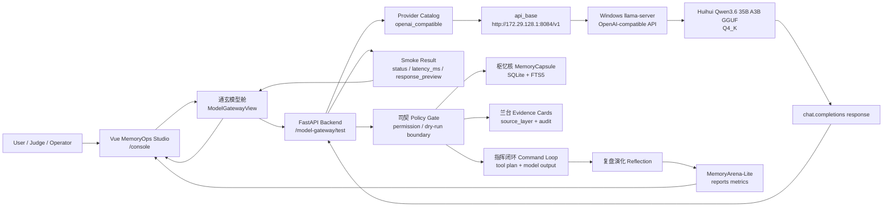
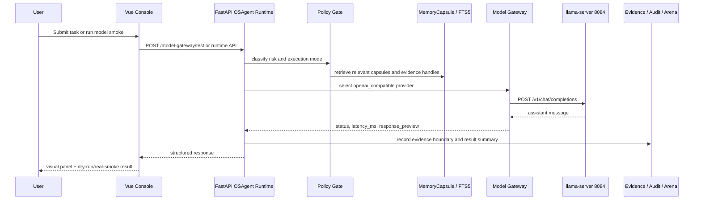
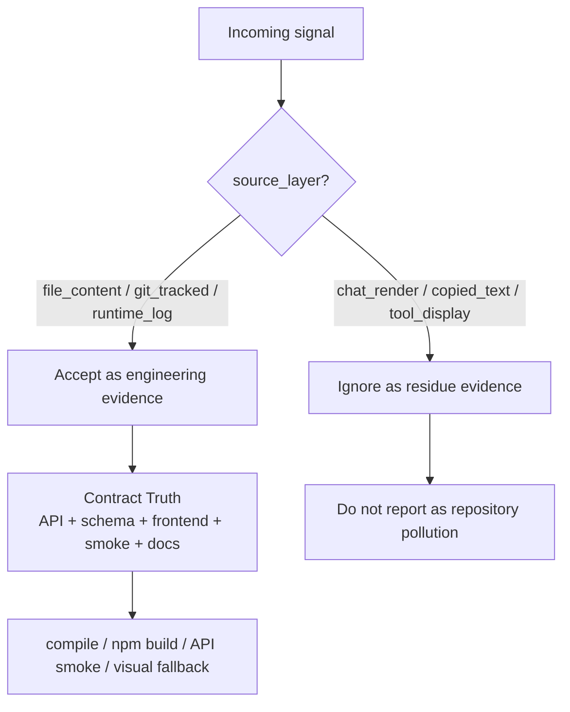

# OSAgent Model Gateway Flow

本图说明本地 llama.cpp 模型通过 OpenAI-compatible API 接入后，宛委·枢忆 OSAgent 的完整运行链路。当前接入点是 `openai_compatible` provider，WSL 通过 Windows WSL vEthernet 地址访问 Windows 上的 `llama-server`。

## Current Runtime State

- Frontend: `frontend/console-vue` built dist mounted at `/console/`.
- Backend: FastAPI `app.main:app`.
- Model gateway API: `GET /model-gateway/providers`, `POST /model-gateway/test`.
- Local model endpoint: `http://172.29.128.1:8084/v1`.
- Windows llama.cpp server: `llama-server` OpenAI-compatible `/v1/chat/completions`.
- Model file: `C:\LLMShare\Huihui-Qwen3.6-35B-A3B-Claude-4.7-Opus-abliterated-ggml-model-Q4_K.gguf`.
- Key policy: no API key is stored, echoed, or printed for the local endpoint.

## End-to-End Flow



## OSAgent Control Loop After Model Access



## Source Layer Boundary



## What Is Implemented

- `backend/app/model_gateway/service.py` now registers `openai_compatible` as an enabled local llama.cpp provider.
- `POST /model-gateway/test` supports real smoke for the local OpenAI-compatible endpoint when `dry_run=false`.
- `frontend/console-vue/src/views/ModelGatewayView.vue` exposes both `Dry-run` and `真实 smoke` buttons.
- The model response is returned only as a short `response_preview`; no raw key is stored or displayed.

## What Remains Partial

- The model is currently connected for gateway smoke and demonstration, not yet wired into every OSAgent runtime decision path.
- The command loop still needs a formal provider-selection policy before model output can drive broader task execution.
- Cost tracking is still relative / planned; real token accounting from llama.cpp is not yet persisted.
- Long-session model evaluation and visual QA over generated responses are planned follow-ups.

## Verification Commands

```bash
curl http://127.0.0.1:8011/model-gateway/providers
curl -X POST http://127.0.0.1:8011/model-gateway/test \
  -H 'Content-Type: application/json' \
  -d '{"provider":"openai_compatible","dry_run":false,"prompt_preview":"请用一句中文确认模型接入。","max_tokens":96}'
```
