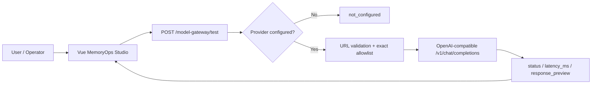
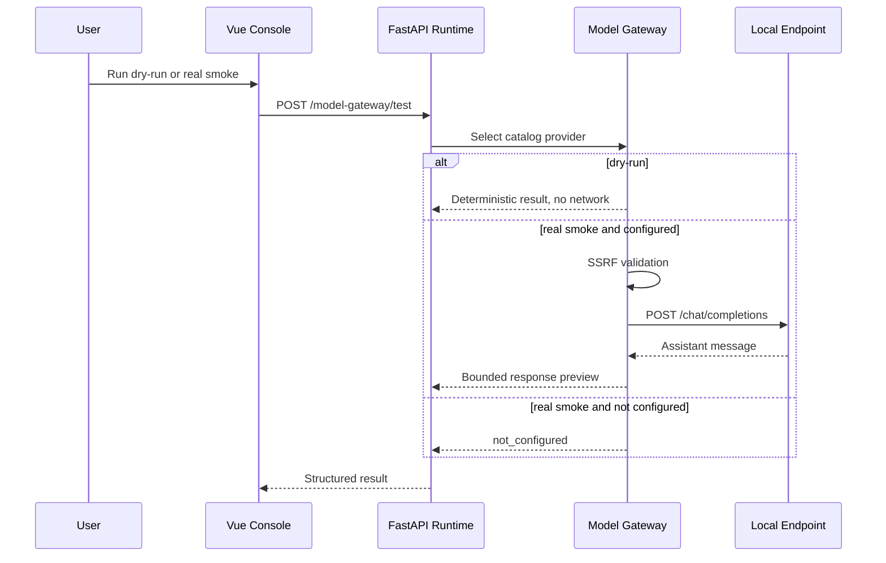

# OSAgent Model Gateway Flow

本文说明可选的本地 llama.cpp/OpenAI-compatible 模型如何接入宛委·枢忆。项目默认不绑定任何开发者私有地址或模型文件；只有显式设置环境变量后，`openai_compatible` provider 才会启用。

## Current Runtime State

- Frontend：Vue 生产构建挂载在 `/console/`。
- Backend：FastAPI `app.main:app`，默认 `http://127.0.0.1:8010`。
- Model gateway API：`GET /model-gateway/providers`、`POST /model-gateway/test`。
- Offline default：`local_mock` 可执行 deterministic dry-run。
- Optional real smoke：需要 `WANWEI_OPENAI_COMPATIBLE_BASE` 与 `WANWEI_OPENAI_COMPATIBLE_MODEL`。
- Key policy：本地 endpoint 不保存、不回显、不打印真实 key。

## Configuration

Windows 示例：

```powershell
$env:WANWEI_OPENAI_COMPATIBLE_BASE='http://127.0.0.1:8084/v1'
$env:WANWEI_OPENAI_COMPATIBLE_MODEL='your-model-id'
$env:WANWEI_OPENAI_COMPATIBLE_HOST_ALLOWLIST='127.0.0.1'
.\scripts\run_dev.ps1
```

本机与私网地址默认受 SSRF 防护阻止。只把实际 endpoint 的精确主机加入 `WANWEI_OPENAI_COMPATIBLE_HOST_ALLOWLIST`，不要加入通配网段。

## End-to-End Flow



## Control Boundary



真实 smoke 是连通性验证，不会自动把模型输出用于工具执行、记忆写入或 Command Loop。更高影响的模型驱动动作仍需要正式的 provider-selection policy、证据绑定、权限检查和人工确认。

## Verification Commands

```powershell
$headers = @{ 'X-API-Key' = 'wanwei-dev-key' }
Invoke-RestMethod http://127.0.0.1:8010/model-gateway/providers
Invoke-RestMethod http://127.0.0.1:8010/model-gateway/test `
  -Method Post -Headers $headers -ContentType 'application/json' `
  -Body '{"provider":"openai_compatible","dry_run":false,"prompt_preview":"请用一句中文确认模型接入。","max_tokens":96}'
```

## Remaining Partial Work

- Anthropic/Gemini 仍是 catalog/stub。
- Command Loop 尚未消费真实模型响应。
- llama.cpp token usage 尚未持久化为成本指标。
- 长会话模型评测与生成结果视觉 QA 仍为 planned。
