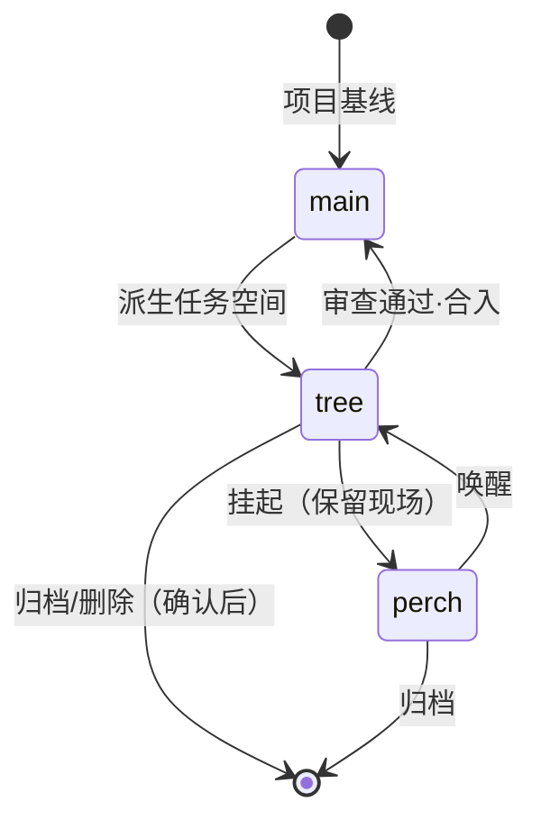

# 宛委·万枢 —— 麒麟桌面级 AI 聊天与开发协作平台 · 架构设计

> 文档状态：M1 冻结版（随本平台首批八模块交付同步）
> 读者对象：平台建设者、并行开发代理、评审与后续维护者
> 项目根：`wan-wei--shuyi-osagent/`（FastAPI `backend/` + Vue3 控制台 `frontend/console-vue/` + Electron 桌面端 `desktop/`）
> 参考资料：工作区根 `design.md`（国风双主题设计规范）、`docs-research/kylin-orca-architecture-notes.md`（麒麟规范与 Orca 理念调研）
> 边界声明：本文描述的端点与能力以代码为最终契约；凡标注「stub / simulated / 规划」者均不构成已可用承诺。

---

## 1. 愿景与定位

### 1.1 一句话定位

「宛委·万枢」是面向麒麟 Linux（KylinOS V10/V11，UKUI 桌面）的**桌面级 AI 聊天与开发协作平台**：
以本地 FastAPI 服务为枢、以国风双主题 Vue 控制台为面、以 Electron 原生壳为体，
把「多模型对话、多智能体并行编排、任务空间隔离、知识库、长期记忆、自动化、MCP 工具枢纽」
收进一台信创桌面，做到**全离线可跑、密钥不出机、改动必经人审**。

命名取义：宛委（传说中藏书之山）主记忆与知识，万枢（枢机万千）主调度与协作。
桌面壳沿用「枢忆·花朝」之名，记忆底座复用「宛委·枢忆」既有研发成果。

### 1.2 为什么是「桌面级」而非「Web 移植」

本平台不是把 Web 控制台套一层浏览器壳。判定一个桌面应用是否「原生级」，
看的是它是否接管了浏览器给不了的系统能力。万枢的桌面级论据如下：

1. **后端守护**：Electron 主进程直接 spawn 并守护 FastAPI 子进程——随机空闲端口、
   `/health` 探活（60 秒超时）、异常退出弹窗指引日志、退出时 SIGTERM（5 秒不退则 SIGKILL）。
   用户双击图标即得完整服务，无需先装 Python、开终端、跑 uvicorn。
2. **系统托盘**：关闭窗口即最小化到托盘常驻（UKUI 通知区标准行为），托盘菜单提供
   显示主窗口 / 浏览器打开 / 自启动开关 / 测试通知 / 退出，符合桌面应用惯例而非网页惯例。
3. **开机自启动**：走 XDG Autostart（用户级 `~/.config/autostart/`）+ Electron
   `setLoginItemSettings` 双通道，做成**应用内开关**由用户主动开启——避开麒麟 V10
   对非白名单自启动项的拦截策略，不做 postinst 强写。
4. **防睡眠**：`powerSaveBlocker` 两档——`app` 仅阻止系统挂起、`display` 连同屏幕常亮，
   保证长时编排运行（agent 跑任务）期间机器不睡。
5. **局域网**：一键切换后端监听 `127.0.0.1 ↔ 0.0.0.0`（热重启后端完成切换），
   自动优选私有网段 IPv4（10./192.168./172.16-31.）生成手机访问地址，
   配合 `/mobile` 页面与 LAN token 构成「移动伴侣」通道。
6. **浮动窗**：420×640 无边框、置顶、跳过任务栏的浮动工作区小窗，
   加载 `/console/#/mobile?floating=1`，让「随手问一句」不占用整个桌面。

另有桌面级基础件：单实例锁（二次启动仅唤起已有窗口）、窗口尺寸位置记忆、
freedesktop 桌面通知、本地文件打开/保存对话框（8MB 读入上限）、
外部链接一律交系统浏览器、`contextIsolation` + `nodeIntegration: false` 的渲染隔离。

### 1.3 Electron 主进程能力清单

| 能力 | 实现要点 | 状态 |
| --- | --- | --- |
| 后端守护 | spawn uvicorn + `/health` 探活 + 日志落 `runtime/backend.log` + 退出码处理 | 已落实 |
| 随机端口与密钥 | 启动期探测空闲端口；API Key 首启生成，`0600` 仅存 userData | 已落实 |
| 系统托盘 | Tray + 上下文菜单 + 关闭即隐藏 + 单击显隐切换 | 已落实 |
| 开机自启动 | XDG autostart 文件 + `setLoginItemSettings`，应用内开关 | 已落实 |
| 防睡眠 | `powerSaveBlocker`：app / display 两种模式，托盘可切 | 已落实 |
| 局域网模式 | 后端热重启切换 `0.0.0.0`；私有网段 IP 优选；`/mobile` 入口 | 已落实（token 配对随 M1 收尾加固） |
| 浮动窗 | 无边框置顶小窗加载移动视图，随时唤起/销毁 | 已落实 |
| 主题跟随 | `nativeTheme` 监听 UKUI 明暗切换，推送渲染进程换「靛夜」主题 | 已落实 |
| 单实例与窗口态 | `requestSingleInstanceLock`；尺寸/位置/最大化持久化 | 已落实 |
| 桌面通知与文件 IPC | `desktop:notify / open-file / save-file / show-item / info / *-autostart` | 已落实 |
| deb 打包上架 | electron-builder + 自包含 Python 运行时 | 规划（M3） |

### 1.4 与既有研发底座的关系

万枢平台**长在**既有「宛委·枢忆 MemoryOps」底座之上，不推倒重来：
记忆运行时（MemoryCapsule 2.0、Policy Gate、审计）、SQLite FTS5 检索、
麒麟官方 embedding/vector SDK 的可选原生检索、模型网关的 local_mock 离线通路，
全部保留并继续可用。万枢在其上新增的是**协作层**——平台 API 聚合包
`backend/app/platform_api/`、控制台 `views/platform/` 视图族、桌面壳六项系统能力。

---

## 2. Orca 架构理念映射

Orca（stablyai/orca）证明了「worktree-native + 多智能体并行 + 人在环审查」这一
范式在桌面端的成立性。万枢取其神而不抄其形（Orca 是编辑器中心，万枢是控制台中心）：

| Orca 理念 | 万枢映射 | 落地说明 |
| --- | --- | --- |
| 并行 git worktree | **tree / main / perch 三态空间**（spaces 模块） | main=主干基线对照；tree=任务工作树，一任务一树、物理隔离互覆；perch=栖枝挂起，保留现场不占并行槽，可唤醒再干活 |
| 多智能体并行 | **编排运行 + 思考深度六档 + 工作档位三档**（agents 模块） | 一次编排 = 一个 run，可挂多 agent；深度决定思考预算，档位决定触达面；默认建议 3–5 路并行，对齐人的审查吞吐量 |
| 移动伴侣 | **`/mobile` 页面 + LAN 模式 + LAN token** | 手机只做三件事：看进度、收完成推送、发后续指令；短时令牌 + 局域网可达，不做全功能客户端 |
| Orca CLI | **wanwei CLI** | 与桌面端共享同一本地 FastAPI 服务，REST 全覆盖 + `--json` 输出，脚本与 agent 皆可驱动平台 |
| Annotate AI Diff | **人工审查档位（human_review）** | diff 行级批注打包回喂 agent；「采纳 / 驳回 / 追问」三态；默认任何 agent 改动须经人工确认才合入主干 |
| Design Mode | **后续路线** | 元素拾取（截图+HTML/CSS 进 prompt）列入 M3 之后，与麒麟截图/录屏权限模型一并评估 |
| Agent 中立（CLI 适配器） | **providers 的 OpenAI 兼容聚合 + mcp_hub 工具接入** | 模型走 API 聚合层，工具走 MCP；两层解耦，任意一家失效不拖垮平台 |
| SSH/远程执行分层 | 路线图候选 | 单节点 alpha 不做；沙盒远置、算力外移留待 M3 之后评估 |

三条主动取舍：

1. **物理隔离优于流程约束**：并行任务必须各占独立分支与目录，不依赖 agent 自觉。
2. **人是瓶颈**：平台内置 diff 聚合与批量归档，默认并行度保守；审查界面是一等功能。
3. **离线优先**：麒麟/信创场景默认零遥测、local_mock 可全链路演示，
   所有真实外部调用「配置就绪才启用」。

---

## 3. 麒麟标准符合性清单

状态口径：**已落实** = 代码中存在且可用；**部分** = 主干就绪、尚有收尾项；**规划** = 仅设计。

| # | 条目 | 状态 | 落实位置 / 备注 |
| --- | --- | --- | --- |
| 1 | XDG 目录规范 | 已落实 | 配置/数据/缓存全走 Electron `userData`（`~/.config/wanwei-shuyi-desktop/`）与 XDG 语义；平台数据经 `WANWEI_PLATFORM_DIR` 可重定向，默认项目内 `data/platform/`（开发态），打包后指向用户数据区 |
| 2 | XDG Autostart 自启动 | 已落实 | 用户级 `~/.config/autostart/wanwei-shuyi-desktop.desktop`，应用内开关；不写系统级、不在 postinst 强写（规避 Kysec 白名单拦截） |
| 3 | UKUI 主题跟随 | 已落实 | `nativeTheme` 事件 + 前端 `prefers-color-scheme` 双通道；day/night 双主题全部走 CSS 变量，禁写死色值 |
| 4 | 托盘与通知 | 已落实 | Tray 符合 StatusNotifier 惯例；通知走 freedesktop（libnotify）；无任何广告式弹窗（Kysec 红线自查通过） |
| 5 | 单实例 / 窗口状态 | 已落实 | 单实例锁 + 窗口几何持久化，UKUI 桌面体验一致 |
| 6 | 防睡眠与电源 | 已落实 | `powerSaveBlocker` 双模式；不请求任何特权 |
| 7 | 沙盒与权限模型 | 部分 | 设计采用用户态隔离（bubblewrap/namespace 方向），不依赖 systemd 服务与内核模块；agent 执行面由三档 gear 门禁约束；device 档默认禁用 |
| 8 | 密钥与凭据 | 部分 | 平台密钥 Fernet 加密落盘（见 §6.2）；桌面 API Key `0600`；系统钥匙串（libsecret）托管列为 M2 项 |
| 9 | deb 打包规划 | 规划 | M3：electron-builder 出 deb（amd64/arm64），mips64el/loongarch64 走离线 Electron + electron-packager；Python 运行时 PyInstaller 自包含进 `/opt/apps/<appid>/`，不依赖系统 Python |
| 10 | desktop 入口与图标 | 规划 | 随 deb 交付 `/usr/share/applications/*.desktop`（含 `Name[zh_CN]`）+ hicolor 多尺寸图标（≥512×512） |
| 11 | Kysec 注意事项 | 部分 | 设计期已规避：无捆绑、无广告弹窗、无非常驻特权、自启动用户态开关；上架前需过「包信息→格式→安全→验签」检测链并备签名（ukey/GPG） |
| 12 | KYSDK / 统一认证 / PAM | 规划 | 深度 UKUI 集成（系统搜索、统一配置、生物识别）评估为 P2，Electron 侧需 native 桥，不阻塞主线 |

---

## 4. 系统架构

### 4.1 总体架构图（ASCII）

```
┌─────────────────────────── 麒麟 Linux 桌面（UKUI） ───────────────────────────┐
│ ┌─────────────────────── Electron 主进程 main.js ───────────────────────┐   │
│ │ 后端守护 · 托盘 · 自启动 · 防睡眠 · LAN 切换 · 浮动窗 · 单实例 · 通知    │   │
│ └───────┬───────────────────────────────────────────────┬──────────────┘   │
│         │ spawn / 守护 / 热重启                          │ preload 桥        │
│         ▼                                               ▼                  │
│ ┌───────────────────┐   同源 REST + X-API-Key   ┌───────────────────────┐  │
│ │  FastAPI 后端      │ ◀──────────────────────▶ │ Vue3 渲染进程（控制台） │  │
│ │  (uvicorn 子进程)  │   /console/ 静态托管      │ hash 路由 · 双主题     │  │
│ └─────────┬─────────┘                          └───────────────────────┘  │
└───────────┼────────────────────────────────────────────────────────────────┘
            │ 浏览器 / 手机(LAN) / wanwei CLI 亦可直连同一服务
┌───────────▼────────────────────────────────────────────────────────────────┐
│ app.main ──/platform──▶ platform_api 包自动发现聚合（模块故障隔离，单点跳过）│
│   providers · agents · spaces · automation · knowledge · memory_center     │
│   system_svc · mcp_hub                                                     │
└───┬──────────────┬───────────────┬────────────────┬────────────────────────┘
    ▼              ▼               ▼                ▼
┌─────────┐  ┌───────────┐  ┌─────────────┐  ┌──────────────────────────┐
│JsonStore│  │SQLite FTS5│  │ 模型网关     │  │ 既有底座：记忆运行时/梦境 │
│platform_│  │ memory.db │  │ OpenAI 兼容 │  │ 审计/工作流/Kylin SDK   │
│*.json   │  │（记忆检索）│  │ 聚合+mock   │  │ （可选原生向量检索）     │
└─────────┘  └───────────┘  └──────┬──────┘  └──────────────────────────┘
                                   ▼
                     31 家模型目录（配置就绪才真实调用）
```

要点：后端模块**零侵入**扩展——新建 `backend/app/platform_api/<模块>.py` 并暴露顶层
`router = APIRouter()` 即被自动挂到 `/platform`；单模块导入失败仅告警跳过，不拖垮整体。
持久化统一 `JsonStore`（整文件读写 + 线程锁 + tmp 替换原子写），
共享枚举集中在 `platform_api/deps.py`，杜绝多头定义漂移。

### 4.2 前端视图分层

```
frontend/console-vue/src/
├─ views/platform/            域视图（hash 路由，base /console/）
│   ├─ WorkbenchView          工作台（总览入口）
│   ├─ ProvidersView          模型接入      ├─ AgentsView      智能体编排
│   ├─ SpacesView             三态空间      ├─ AutomationView  自动化
│   ├─ KnowledgeView          知识库        ├─ MemoryCenterView 记忆中心
│   ├─ SessionsView           会话          ├─ MobileView      移动伴侣/浮动窗
│   └─ SettingsView / HelpView 设置与帮助
├─ api/platform.ts            apiGet/apiPost/apiPut/apiDel（base 已含 /platform）
├─ components/gf/             国风共享组件：GfCard/GfTag/GfButton/GfStat/GfEmpty/
│                             PageHero/InkDivider/ThemeToggle/PetalFall 等
└─ tokens.css                 宣纸·白昼 / 靛夜·灯影 双主题 CSS 变量（禁写死色值）
```

前端纪律：视图对缺字段容错（可选链 + 默认值 + 离线兜底示例数据）；
样式只用主题变量与 gf 组件；图标禁用 emoji，文字与 CSS 图形代之。

### 4.3 关键数据流：一次编排运行

```
用户在 AgentsView 发起编排
  → POST /platform/agents/runs（含 depth 深度 + gear 档位 + 目标 space）
  → agents 校验 gear 门禁（device 档默认拒绝）
  → spaces 为该 run 准备 tree 空间（独立分支/目录）
  → providers 按 run 指定模型路由（OpenAI 兼容聚合；未配置→显式 stub）
  → 运行事件流式落 JsonStore（runs 记录）并推前端
  → gear=human_review：产出仅入「待审查」，diff 批注回喂后才允许合入 main
  → 全程审计留痕；记忆中心按需写入「记住」条目，夜间梦境任务统一整理
```

---

## 5. 模块目录

> 端点均以 `/platform` 为前缀；下表为 M1 契约口径，最终以各模块代码为准。
> 路由顺序约定：固定路径（如 `/providers/aux`）定义须避开参数路径
> （如 `/providers/configs/{pid}`）的匹配冲突。

### 5.1 providers —— 模型接入（31 家）

职责：统一维护模型厂商目录（catalog）与用户接入配置（configs），
密钥 Fernet 加密落盘；提供连通性测试（配置就绪才真实调用，否则返回明确 stub 标识）；
向 agents/会话提供统一路由出口。固定辅助端点 `/providers/aux` 提供枚举与元数据。

内置 31 家厂商目录：

| # | 厂商 | 接入形态 | # | 厂商 | 接入形态 |
| --- | --- | --- | --- | --- | --- |
| 1 | OpenAI | OpenAI 兼容 | 17 | 腾讯混元 | OpenAI 兼容 |
| 2 | Anthropic（Claude） | 原生协议 stub→M2 | 18 | 商汤日日新 | OpenAI 兼容 |
| 3 | Google Gemini | 原生协议 stub→M2 | 19 | 阶跃星辰 Step | OpenAI 兼容 |
| 4 | xAI（Grok） | OpenAI 兼容 | 20 | MiniMax | OpenAI 兼容 |
| 5 | Mistral AI | OpenAI 兼容 | 21 | 零一万物 Yi | OpenAI 兼容 |
| 6 | Cohere | OpenAI 兼容 | 22 | 百川智能 | OpenAI 兼容 |
| 7 | OpenRouter（聚合） | OpenAI 兼容 | 23 | 昆仑万维天工 | OpenAI 兼容 |
| 8 | Together AI | OpenAI 兼容 | 24 | 华为盘古 | OpenAI 兼容 |
| 9 | Groq | OpenAI 兼容 | 25 | 月之暗面 Kimi | OpenAI 兼容 |
| 10 | DeepInfra | OpenAI 兼容 | 26 | 深度求索 DeepSeek | OpenAI 兼容 |
| 11 | Perplexity | OpenAI 兼容 | 27 | Ollama（本地） | 本地 OpenAI 兼容 |
| 12 | 智谱 AI（GLM） | OpenAI 兼容 | 28 | LM Studio（本地） | 本地 OpenAI 兼容 |
| 13 | 阿里通义千问 | OpenAI 兼容 | 29 | vLLM（自托管） | 本地 OpenAI 兼容 |
| 14 | 字节豆包（火山方舟） | OpenAI 兼容 | 30 | llama.cpp server | 本地 OpenAI 兼容 |
| 15 | 百度文心（千帆） | OpenAI 兼容 | 31 | Xinference（自托管） | 本地 OpenAI 兼容 |
| 16 | 讯飞星火 | OpenAI 兼容 | | | |

关键端点：

| 方法 | 路径 | 说明 |
| --- | --- | --- |
| GET | `/platform/providers/catalog` | 31 家内置目录（只读） |
| GET | `/platform/providers/aux` | 枚举/元数据辅助（固定路径，先于参数路由注册） |
| GET/POST | `/platform/providers/configs` | 接入配置列表 / 新建（密钥只写不读，回显掩码） |
| GET/PUT/DELETE | `/platform/providers/configs/{pid}` | 单配置读取 / 修改 / 删除 |
| POST | `/platform/providers/configs/{pid}/test` | 连通性测试（未配置密钥→明确 stub 应答） |

### 5.2 agents —— 智能体编排

职责：编排运行（run）的创建、事件流、停止与归档；向全平台暴露
**思考深度六档**与**工作档位三档**两套共享语义（枚举统一定义于 `platform_api/deps.py`）。

思考深度六档（由浅到深，决定思考预算与适用面）：

| 键 | 中文 | 语义建议 |
| --- | --- | --- |
| low | 浅思 | 快问快答、闲聊、格式化小任务 |
| medium | 常思 | 日常问答与摘要，默认档 |
| high | 深思 | 需要推理链的分析、改写、排错 |
| xhigh | 极思 | 多步规划、跨文件改动方案 |
| max | 穷思 | 穷尽式推演，长任务审慎使用 |
| ultracode | 超码 | 代码生成/重构专项深度档 |

工作档位三档（决定 agent 被允许触达的执行面，即 gear 门禁）：

| 键 | 中文 | 执行面 |
| --- | --- | --- |
| human_review | 人工审查 | 默认档。agent 只产出建议与 diff，任何落盘/合入须经人工确认（对应 Orca Diff 批注闭环） |
| sandbox | 沙盒工作 | 白名单目录 + 白名单命令内可自主执行；越界即拒并留审计 |
| device | 整台设备 | 整机触达面；alpha 默认禁用，启用需显式授权并全程审计 |

关键端点：

| 方法 | 路径 | 说明 |
| --- | --- | --- |
| GET | `/platform/agents/depths` · `/platform/agents/gears` | 两套枚举与中文标签（前端唯一来源） |
| GET/POST | `/platform/agents/runs` | 编排运行列表 / 发起（depth+gear+space 三元组） |
| GET | `/platform/agents/runs/{rid}` | 运行详情与状态机 |
| GET | `/platform/agents/runs/{rid}/events` | 事件流（轮询/流式） |
| POST | `/platform/agents/runs/{rid}/stop` | 停止并归档现场 |

### 5.3 spaces —— tree / main / perch 三态空间

职责：承载「并行 worktree」理念的空间实体与状态机。
**main** 为项目主干基线（对照、合并目标）；**tree** 为任务工作树——一个并行任务一棵树，
独立目录与分支，从物理上消除共享工作区的互覆与碰撞；**perch** 为栖枝态——
挂起保留现场、不占用并行槽位，可随时唤醒回 tree 或最终归档。
状态机：`创建 → 工作中 → 待审查 → 已合并 / 已归档`，perch 为旁路挂起态。
alpha 期 worktree 实体以目录级隔离 + 状态机建模，真实 `git worktree` 绑定列入 M2。



关键端点：

| 方法 | 路径 | 说明 |
| --- | --- | --- |
| GET/POST | `/platform/spaces` | 空间列表（可按态过滤）/ 创建（指定基线） |
| GET/PUT/DELETE | `/platform/spaces/{sid}` | 详情 / 状态流转 / 删除（带确认） |
| GET | `/platform/spaces/{sid}/diff` | 相对基线的差异视图（审查入口） |
| POST | `/platform/spaces/{sid}/merge` | 合入主干（human_review 门禁校验） |
| POST | `/platform/spaces/{sid}/perch` · `/wake` | 挂起为栖枝 / 唤醒 |

### 5.4 automation —— 自动化

职责：定时/手动触发的自动化作业（cron 式计划 + 立即运行），作业记录与最近一次结果留痕；
是「每夜梦境」「定时检索整理」「计划会话」等能力的调度底座。麒麟桌面休眠场景下
与防睡眠能力联动：有在跑作业时可申请临时阻止挂起。

| 方法 | 路径 | 说明 |
| --- | --- | --- |
| GET/POST | `/platform/automation/jobs` | 作业列表 / 新建（cron 表达式 + 动作定义） |
| GET/PUT/DELETE | `/platform/automation/jobs/{jid}` | 详情 / 修改 / 删除 |
| POST | `/platform/automation/jobs/{jid}/run` | 立即触发一次 |
| POST | `/platform/automation/jobs/{jid}/toggle` | 启用 / 停用 |
| GET | `/platform/automation/runs` | 运行历史（跨作业） |

### 5.5 knowledge —— 知识库

职责：文档的收录、分块、检索与出处管理。检索后端复用既有底座——
麒麟官方 embedding/vector SDK 可用时走原生向量检索，不可用或失败时**显式回退**
SQLite FTS5（回退事实在响应中如实标注）。多源入口（JSON/Markdown/PDF/日志）
沿既有 source layer 校验管线，不入库不明来源内容。

| 方法 | 路径 | 说明 |
| --- | --- | --- |
| GET/POST | `/platform/knowledge/docs` | 文档列表 / 收录（文本或文件） |
| GET/DELETE | `/platform/knowledge/docs/{did}` | 详情（含分块与出处）/ 移除 |
| POST | `/platform/knowledge/search` | 检索（标明向量/FTS5 实际通道） |
| POST | `/platform/knowledge/ingest` | 批量导入（dry-run 预检 + 确认入库） |

### 5.6 memory_center —— 记忆中心

职责：面向用户的长期记忆门面，底层复用 MemoryCapsule 2.0 与既有记忆运行时。
两条特色通路：

1. **记住指令**：用户说「记住……」即生成记忆条目；单条**不超过 200 行**，
   超长拒收并提示拆分；写入前过 Policy Gate，敏感内容进隔离区。
2. **梦境**：每夜定时（automation 承载，默认凌晨低峰）对记忆做整理——
   压缩冗余、合并近义、标记冲突、生成梦境摘要；摘要次日在记忆中心可阅，
   整理动作全部留审计，不做静默删除。

| 方法 | 路径 | 说明 |
| --- | --- | --- |
| GET/POST | `/platform/memory/capsules` | 记忆列表 / 写入 |
| POST | `/platform/memory/remember` | 记住指令快捷入口（≤200 行校验） |
| POST | `/platform/memory/search` | 记忆检索（Evidence Cards 证据卡） |
| GET | `/platform/memory/dream/status` | 梦境计划与最近一次摘要 |
| POST | `/platform/memory/dream/trigger` | 立即做一次梦境整理（审计留痕） |

### 5.7 system_svc —— 系统服务

职责：平台级运行信息与桌面能力的服务端出口——健康与就绪、版本与模块清单、
防睡眠状态镜像、LAN 模式状态与手机配对 token 签发、自启动状态查询；
桌面主进程经 IPC 与本地 REST 双通道与此模块对齐状态。

| 方法 | 路径 | 说明 |
| --- | --- | --- |
| GET | `/platform/system/health` | 平台聚合健康（各模块就绪位） |
| GET | `/platform/system/info` | 版本、运行时长、数据目录、模块清单 |
| GET/POST | `/platform/system/power` | 防睡眠状态查询 / 模式设置 |
| GET/POST | `/platform/system/lan` | LAN 状态 / 开关与地址；POST `.../lan/token` 签发配对令牌 |
| GET | `/platform/system/autostart` | 自启动状态镜像（与桌面端一致） |

### 5.8 mcp_hub —— MCP 工具枢纽

职责：MCP（Model Context Protocol）服务器注册表与工具调用代理。
alpha 期提供注册、探活、工具清单与调用转发骨架；真实 stdio/SSE 连接为 M2 主线，
未连通前一切调用返回明确 `simulated` 标识。平台自身能力（建空间、读运行、发指令）
亦规划经 MCP 反向暴露，使接入的 agent 可驱动平台。

| 方法 | 路径 | 说明 |
| --- | --- | --- |
| GET/POST | `/platform/mcp/servers` | 服务器注册表（stdio/SSE 定义） |
| GET/DELETE | `/platform/mcp/servers/{sid}` | 详情与状态 / 注销 |
| GET | `/platform/mcp/servers/{sid}/tools` | 工具清单（未连通→空表+状态说明） |
| POST | `/platform/mcp/call` | 统一工具调用入口（alpha 返回 simulated） |

---

## 6. 安全与边界

### 6.1 单节点 alpha 定位

本平台当前为**可运行单节点 alpha**：默认绑定 `127.0.0.1`、单进程 SQLite/JSON 持久化、
不提供多副本高可用与生产 SLA；LAN 模式是显式开关而非默认，且须凭 token 访问。
任何对外暴露面扩大（公网、多用户）都属路线图事项，需重新评审安全模型。

### 6.2 密钥管理（Fernet）

- providers 的各家 API 密钥：**Fernet 对称加密**后随 JsonStore 落盘，
  接口只写不读（回显掩码），日志与事件流一律脱敏。
- 主密钥：由桌面端首启生成，`0600` 存于用户数据区，与数据文件分离；
  环境变量可覆盖以支持无桌面部署。`cryptography` 已在后端依赖内，无新增依赖。
- 桌面通道 API Key：随机生成、`0600`，经 preload 注入渲染进程，主进程兜底补请求头；
  LAN token 为短时用途令牌，与主密钥分离，可随时吊销重签。

### 6.3 沙盒白名单与 gear 门禁

- 三档 gear 是**硬门禁**：`human_review` 档 agent 无落盘权；`sandbox` 档仅放行
  白名单目录与命令，越界拒绝并审计；`device` 档默认禁用，启用需显式授权。
- 沙盒实现坚持用户态隔离路线（bubblewrap/namespace 方向），不依赖 systemd 服务、
  内核模块或任何 Kysec 白名单外特权，提权操作走系统授权弹窗（policykit）而非自造密码框。
- 全平台动作审计沿用既有 audit 管线：谁（人/agent）、何时、何档位、动了什么。

### 6.4 stub / simulated 诚实清单

| 能力 | 当前口径 | 何时转真 |
| --- | --- | --- |
| 真实模型 API 调用 | 配置就绪（密钥+端点+测试通过）才启用，否则明确 stub | 用户完成配置即转真 |
| Anthropic / Gemini 原生协议 | catalog 配置 stub，不宣称已接入生产调用 | M2 原生接入 |
| MCP 真实连接 | 注册与调用骨架可用，调用返回 simulated 标识 | M2 stdio/SSE 客户端 |
| git worktree 真实绑定 / push / 开 PR | alpha 为目录级隔离与状态机；push/PR 需 token，未配置为 simulated | M2 |
| OAuth 第三方登录 | 未实现，仅设计备忘 | M3 之后评估 |
| 知识库向量检索 | Kylin SDK 可用才原生；否则显式回退 FTS5 并标注 | 依运行环境 |
| device 整台设备档 | 默认禁用 | 授权模型评审后 |
| 遥测 | **零遥测**，信创默认离线 | 不计划 |

---

## 7. 路线图

| 里程碑 | 范围 | 验收口径 |
| --- | --- | --- |
| **M1（本批，已完成口径）** | platform_api 八模块骨架与契约端点；桌面六项系统能力；三态空间状态机；JsonStore 持久化；gf 组件与双主题全部视图；离线 stub 全链路可走通 | `import app.main` 通过；前端 `npm run build` 通过；桌面 `node --check` 通过；全模块在无网环境以 stub 可演示完整动线 |
| **M2** | 真实 MCP 连接（stdio/SSE）；真实模型接入（OpenAI 兼容 smoke + Anthropic/Gemini 原生）；LAN token 配对强化与吊销；spaces 绑定真实 `git worktree`；沙盒 bubblewrap 落地；libsecret 钥匙串托管 | 真实密钥下端到端跑通一次「编排→审查→合入」；MCP 至少接通一个真实服务器 |
| **M3** | deb 打包（electron-builder + PyInstaller 自包含，装 `/opt/apps/`）；amd64/arm64 CI 与 mips64el/loongarch64 离线 Electron 方案；ukey/GPG 签名；麒麟商店上架材料；KYSDK 集成评估 | 麒麟 V10/V11 真机安装-启动-自启动-主题跟随-卸载全流程通过；Kysec 检测链过审 |

M3 之后候选：Design Mode 元素拾取、SSH/远程算力分层、多用户与协作后台、
统一认证/PAM 集成——均以麒麟权限模型评审为前置。

---

## 附 A. 名词速查

| 名词 | 含义 |
| --- | --- |
| 万枢 | 本平台总名；亦指平台 API 聚合层 |
| 三态空间 | main（主干）/ tree（工作树）/ perch（栖枝挂起） |
| 深度六档 | low/medium/high/xhigh/max/ultracode（浅思/常思/深思/极思/穷思/超码） |
| 档位三档 / gear | human_review/sandbox/device（人工审查/沙盒工作/整台设备） |
| 记住指令 | 用户口述「记住……」生成的记忆条目，单条 ≤200 行 |
| 梦境 | 每夜记忆整理任务：压缩、合并、标冲突、出摘要 |
| LAN 模式 | 后端监听 `0.0.0.0` + token 访问的局域网移动伴侣通道 |
| JsonStore | `platform_api/store.py` 提供的 JSON 落盘持久化（get/set/all/update） |
| stub / simulated | 配置未就绪时的诚实降级应答标识，不冒充真实调用 |


---

## 附 B. 许可证

本项目采用麒麟/openKylin 生态的国产开源许可证——木兰宽松许可证第2版
（Mulan Permissive Software License, Version 2，Mulan PSL v2），官方中文全文
见仓库根目录 `LICENSE`，官方发布地址 http://license.coscl.org.cn/MulanPSL2 。
该许可证中英文版本具有同等法律效力，如有冲突以中文版为准。第三方依赖仍
遵循其各自许可证（见各依赖元数据），与本项目的许可选择相互独立。
